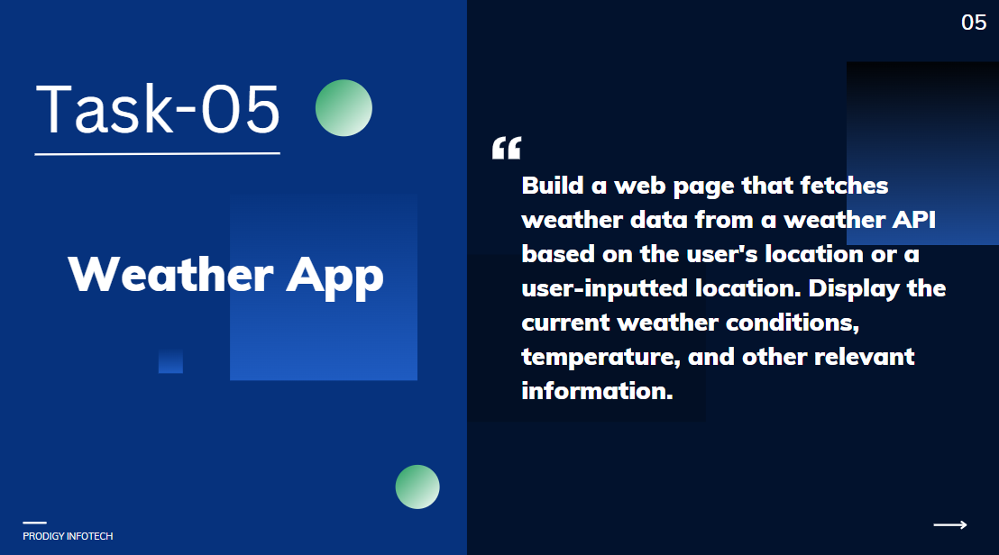

# Task 5: Weather App

🚀 **Internship**: Web Development @ Prodigy InfoTech  
📁 **Task**: Build a real-time weather app using a weather API

## 🛠️ Tech Stack:
- HTML
- CSS
- JavaScript
- OpenWeatherMap API

## 🌦️ Features:
- Fetch weather by city name
- Display temperature, humidity, and condition icons
- Clean & responsive UI
- Error handling for invalid inputs

## 📸 Screenshot:

## 🔗 GitHub Repo:
[https://github.com/Prayoswini/PRODIGY_WD_05](https://github.com/Prayoswini/PRODIGY_WD_05)
